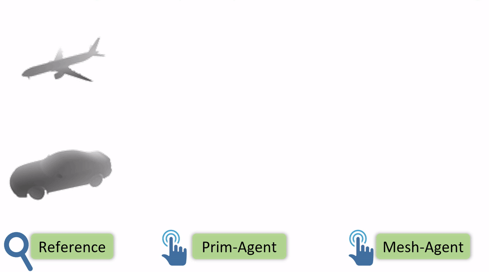

# Modeling 3D Shapes by Reinforcement Learning

This repository contains the source code for the ECCV 2020 paper [Modeling 3D Shapes by Reinforcement Learning](https://arxiv.org/abs/2003.12397), where we made an initial attempt to model 3D shapes like human modelers using deep reinforcement learning (DRL). 

<a href="https://arxiv.org/abs/2003.12397">

</a>


## Fast demo
```
cd demo
python prim_agent_demo.py
python mesh_agent_demo.py
```
This demo takes as input an RGB image for reference. The Prim-Agent will generate a primitive-based representation and create a folder `prim_result/` to save some intermediate results. The Prim-Agent will load the primitives saved in `prim_result/` to edit its mesh; some intermediate results will be saved in `mesh_result/`.

## Code
### Installation
You need to install [PyTorch](https://pytorch.org/), [NumPy](https://numpy.org/) and [SciPy](https://www.scipy.org/). This code is tested under Python 3.7.4, PyTorch 1.3.0, NumPy 1.17.2 and SciPy 1.3.1 on Ubuntu 18.04.4.

You may optionally install [TensorboardX](https://github.com/lanpa/tensorboardX) to visualize the training. The repository contains a part of the code from [binvox](https://www.patrickmin.com/binvox/).

### Training
* Train Prim-Agent first
```
cd Prim-Agent
python train.py
```
* Then use the trained Prim-Agent to generate primitives and edge loop files for all the data
```
python generate_edgeloop.py
```
* Train Mesh-Agent using the output of Prim-Agent
```
cd Mesh-Agent
python train.py
```
* Will need to provide paths to the training data and saving results & logs when calling.
* Can change the setting by modifying the parameters in `Prim-Agent/config.py` or `Mesh-Agent/config.py` 

### Testing
* Call `Prim-Agent/test.py` and `Mesh-Agent/test.py` for testing. Will need to provide paths to the data and the pre-trained model when calling.

### Download
* Data [data.zip](https://drive.google.com/file/d/1inwGXugUEB_vbmTjl33gfWWPhAw594Fv/view?usp=sharing)
* Pre-trained model [pretrained.zip](https://drive.google.com/file/d/1VTM4--sf0xas29s_frF7_tZsPNFTNcFL/view?usp=sharing)
* Unzip the downloaded files to replace the `data` and `pretrained` folders; then you can directly run the code without modifying the arguments when calling `train.py` and `test.py`.


## Citation:  
If you find our work useful in your research, please consider citing:
```
@article{lin2020modeling,
  title={Modeling 3D Shapes by Reinforcement Learning},
  author={Lin, Cheng and Fan, Tingxiang and Wang, Wenping and Nie{\ss}ner, Matthias},
  journal={arXiv preprint arXiv:2003.12397},
  year={2020}
}
```

## Contact:
If you have any questions, please email Cheng Lin at chlin@hku.hk.
